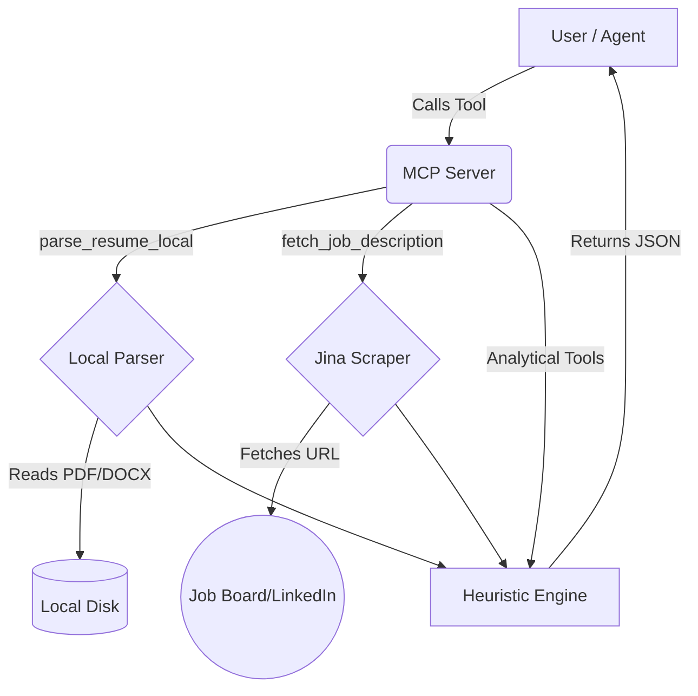
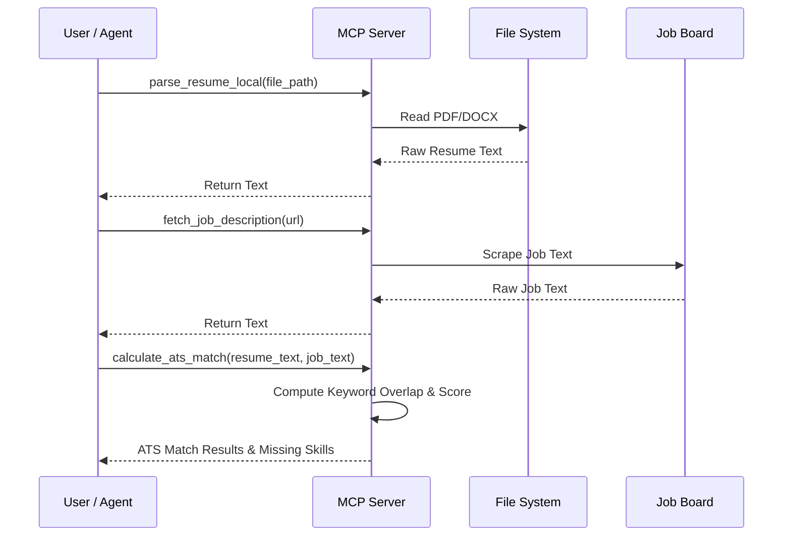

# Resume Assistant MCP

<div align="center">


An intelligent, zero-cost MCP server that securely parses local resumes and compares them against live job postings for ATS scoring, skill gap analysis, and interview prep.

</div>

## Architecture

### System Flow


### Sequence: Resume → Job URL → ATS Analysis


## Features

| Tool | Description |
|------|-------------|
| `parse_resume_local` | Extracts raw text securely from a local PDF, DOCX, TXT, or MD file. |
| `fetch_job_description` | Scrapes the raw text of a job posting from a URL (e.g. LinkedIn, Greenhouse). |
| `calculate_ats_match` | Calculates keyword overlap and generates a percentage ATS match score. |
| `generate_interview_questions` | Generates targeted technical and HR interview questions based on match results. |
| `get_resume_improvements` | Analyzes resume content (length, metrics, action verbs) and provides actionable tips. |
| `generate_cover_letter` | Generates a targeted cover letter template injecting candidate-specific matches. |
| `linkedin_profile_optimizer` | Analyzes LinkedIn profile text and suggests formatting and content improvements. |
| `skill_gap_analysis` | Compares resume against job to identify missing skills and generate a learning roadmap. |

## Quick Start

1. **Clone the repository:**
   ```bash
   git clone https://github.com/rajesh-kayal-dev/resume-assistant-mcp.git
   cd resume-assistant-mcp
   ```

2. **Install dependencies:**
   ```bash
   npm install
   ```

3. **Start the development server:**
   ```bash
   npm run dev
   ```

4. **Run tests:**
   ```bash
   npm test
   ```

5. **Test with MCP Inspector (or MCPize Playground):**
   ```bash
   npx @modelcontextprotocol/inspector node dist/index.js
   # Or using MCPize:
   mcpize dev --playground
   ```

## Example Prompts

Copy and paste these prompts into your favorite MCP-compatible AI (like Claude Desktop or the MCPize Playground):

1. "Parse my resume at `C:\resumes\my_resume.pdf`."
2. "Fetch the job description from `https://www.linkedin.com/jobs/view/12345/`."
3. "Parse my resume at `resume.pdf` and compare it against `https://example.com/job`. Give me the ATS match score."
4. "Analyze my resume at `resume.pdf` and provide improvement tips."
5. "Read my resume at `resume.pdf` and the job at `https://example.com/job`, then generate a custom cover letter."
6. "Run a skill gap analysis for my resume at `resume.pdf` against the job description at `https://example.com/job`."
7. "Generate 5 technical interview questions based on my missing skills for the job at `https://example.com/job` using my resume `resume.pdf`."
8. "Optimize my LinkedIn About section text: 'I am a software engineer looking for a job...'"

## API Reference

### `parse_resume_local`
*Extract raw text from local files.*
**Input:**
| Parameter | Type | Required | Description |
|-----------|------|----------|-------------|
| `file_path` | `string` | Yes | Absolute or relative path to the local resume file. |

**Output:**
```json
{
  "text": "John Doe\nSoftware Engineer..."
}
```
*Note: Uses `unpdf` and `mammoth` for local parsing without external API calls.*

### `fetch_job_description`
*Scrape job postings from URLs.*
**Input:**
| Parameter | Type | Required | Description |
|-----------|------|----------|-------------|
| `url` | `string` | Yes | The full URL of the job posting. |

### `calculate_ats_match`
*Compute ATS Match Score.*
**Input:**
| Parameter | Type | Required | Description |
|-----------|------|----------|-------------|
| `resume_text` | `string` | Yes | The raw parsed text of the candidate's resume. |
| `job_text` | `string` | Yes | The raw text of the job description. |

**Output:**
```json
{
  "match_score": 85,
  "matched_keywords": ["react", "typescript"],
  "missing_keywords": ["docker", "kubernetes"]
}
```

### `skill_gap_analysis`
*Generate a multi-phase learning roadmap.*
**Input:**
| Parameter | Type | Required | Description |
|-----------|------|----------|-------------|
| `resume_text` | `string` | Yes | Raw resume text. |
| `job_text` | `string` | Yes | Raw job text. |

## Project Structure

```
resume-assistant-mcp/
├── src/
│   ├── index.ts                 # MCP Server entry point and tool registration
│   ├── tools/                   # Pure function logic for all 8 tools
│   │   ├── parse-resume-local.ts
│   │   ├── calculate-ats-match.ts
│   │   └── ...
│   └── lib/                     # Shared utilities
│       ├── api-client.ts        # Cached scraper
│       └── cache.ts             # In-memory caching logic
├── tests/                       # Vitest unit tests
├── package.json                 # Dependencies and scripts
├── mcpize.yaml                  # Deployment configuration
└── test-mcp.sh                  # Smoke test script
```

## Deployment

### Deploy via MCPize
```bash
mcpize deploy
```
Your server will be instantly available on the MCPize Cloud.

### Bare Metal / Docker
You can easily containerize this application by building a standard Node.js Docker image, exposing port `8080`, and running `npm start`.

## Roadmap

- **Short-term:** Improve stopword filtering in the ATS matching heuristic.
- **Medium-term:** Add native PDF generation to export customized cover letters.
- **Long-term:** Implement local embeddings/RAG for deeper semantic skill matching instead of exact keyword matching.

## Use Cases

- **Job Seekers:** Automatically tailor resumes and cover letters for hundreds of applications.
- **Career Changers:** Identify exact skill gaps to bridge between current experience and target roles.
- **Students:** Get actionable formatting feedback on their first professional resumes.
- **Recruiters:** Batch-analyze candidates against specific job descriptions to rank them by objective ATS criteria.
- **Career Coaches:** Generate automated reports and interview prep questions for clients.

## FAQ

**Q: Does this cost money to run?**
A: No! The server uses a Zero API Cost strategy. All ATS scoring, parsing, and analysis rely on local regex and string manipulation heuristics rather than expensive LLM endpoints.

**Q: Is my resume data sent to OpenAI?**
A: No. `parse_resume_local` reads the file locally on your machine. The text is only sent to an LLM if the AI client you connect the server to decides to pass it in a prompt.

**Q: Why isn't my PDF parsing correctly?**
A: Ensure it is a text-based PDF. Image-based PDFs (scanned documents) are not currently supported by `unpdf`.

**Q: Why does the job scraper fail on some sites?**
A: The scraper uses the Jina Reader API, which handles JavaScript-heavy sites well, but certain extremely strict bot-protected sites may block it.

**Q: Can I run this without MCPize?**
A: Absolutely! It is a standard Express-based HTTP server exposing the official `@modelcontextprotocol/sdk`.

**Q: How accurate is the ATS Match score?**
A: The heuristic engine strips stopwords and matches alphanumeric keywords. It is a highly effective approximation of older ATS systems but lacks deep semantic understanding (e.g., it won't map "Node.js" to "JavaScript" automatically). *This limitation is documented and will be addressed in future roadmap updates.*

**Q: How do I change the port?**
A: Set the `PORT` environment variable before running the server (e.g., `PORT=3000 npm run dev`).

**Q: Can I add my own tools?**
A: Yes! Simply create a new file in `src/tools/`, write a pure TypeScript function, define the Zod schema, and register it in `src/index.ts`.

---
*Built with [MCPize](https://mcpize.com)*
